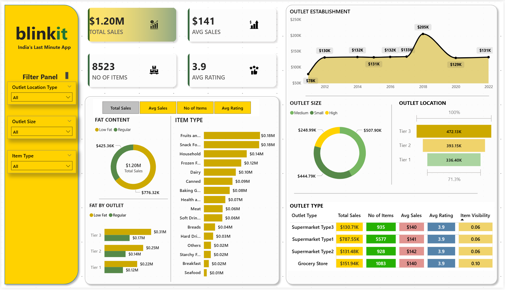

# 📊 Blinkit Sales & Customer Insights — End-to-End Analytics Project

This project delivers a complete **data analysis, KPI computation, and business intelligence dashboard** for Blinkit using **SQL, Python, and Power BI**.
It provides insights into sales performance, customer ratings, outlet characteristics, and inventory distribution — aligned fully with the business requirements document.


---

# 📁 Project Structure

```
├── data/
│   └── BlinkIT Grocery Data.csv
│   └── BlinkIT Grocery Data.sql
├── python notebook/
│   └── blinkit_analysis_in_python.ipynb
├── sql/
│   └── blinkit_analysis_queries.sql
├── dashboard/
│   └── blinkit_analysis_dashboard.pbix
├── docs/
│   ├── Query Doc.docx
│   └── Blinkit Analysis Requirements.pptx
├── images/
│   └── Avg Sales.png
│   └── background kpi.png
│   └── items.png
│   └── rating.png
│   └── Sales.png
│   └── blinkit dashboard.png
└── README.md
```

---

# 🎯 Project Objective

To conduct a comprehensive analysis of **Blinkit's sales performance**, **customer satisfaction metrics**, and **outlet characteristics**, and convert those insights into a **visually rich Power BI dashboard** and **query-driven KPIs**.


The analysis covers:

* Revenue insights
* Customer rating patterns
* Outlet-level performance
* Item characteristics (fat content, type, visibility)
* Sales distribution across regions and establishment years

---

# 📌 Key Business Requirements

The project addresses every KPI and visualization defined in the requirement document:


### **1. Top-Level KPIs**

* Total Sales
* Average Sales
* Number of Items
* Average Rating

### **2. Granular Analysis KPIs**

* Sales by Fat Content
* Sales by Item Type
* Fat Content by Outlet
* Sales by Outlet Establishment Year

### **3. Dashboard Visualizations**

* % Sales by Outlet Size
* Sales by Outlet Location
* All Metrics by Outlet Type

---

# 🗄️ Dataset Description

The dataset consists of sales, inventory, and product metadata used for building descriptive analytics and KPIs.

Key columns include:

* `Item_Identifier`
* `Item_Fat_Content`
* `Item_Type`
* `Item_Visibility`
* `Outlet_Identifier`
* `Outlet_Size`
* `Outlet_Location_Type`
* `Outlet_Type`
* `Outlet_Establishment_Year`
* `Total_Sales`
* `Rating`

---

# 🧹 Data Cleaning (SQL)

The dataset had inconsistent values such as `"LF"`, `"low fat"`, `"reg"` in the `Item_Fat_Content` field.
These were standardized using SQL transformations:


```sql
SET SQL_SAFE_UPDATES = 0;

UPDATE blinkit_data
SET Item_Fat_Content =
CASE
    WHEN Item_Fat_Content IN ('LF', 'low fat') THEN 'Low Fat'
    WHEN Item_Fat_Content = 'reg' THEN 'Regular'
    ELSE Item_Fat_Content
END;
```

---

# 🧮 SQL-Based KPI Extraction

All SQL queries used for KPI computation are included in the project.


### **1. Total Sales**

```sql
SELECT CONCAT(CAST(SUM(Total_Sales)/1000000 AS DECIMAL(10,2)), ' M') 
AS Total_Sales_in_Millions
FROM blinkit_data;
```

### **2. Average Sales**

```sql
SELECT CAST(AVG(Total_Sales) AS DECIMAL(10,2)) AS AVG_Sales 
FROM blinkit_data;
```

### **3. Number of Items**

```sql
SELECT COUNT(*) AS No_of_Orders 
FROM blinkit_data;
```

### **4. Average Rating**

```sql
SELECT CAST(AVG(Rating) AS DECIMAL(10,2)) AS AVG_Rating 
FROM blinkit_data;
```

Additional SQL includes break-downs by fat content, item type, outlet type, outlet size, and establishment year.

---

# 🐍 Data Analysis in Python

All exploratory analysis and data profiling were performed in the Jupyter Notebook:
`blinkit_analysis_in_python.ipynb`

### Key Steps:

* Import & basic inspection
* Missing value analysis
* Distribution analysis (sales, ratings, visibility)
* Grouped aggregations
* Outlet-level profiling
* Generation of charts used as reference for Power BI

---

# 📊 Power BI Dashboard

The Power BI dashboard delivers interactive insights aligned with all business KPIs.

### Dashboard Highlights

* **Top KPIs**: Total Revenue, Avg Sales, Avg Rating, Item Count
* **Fat Content Breakdown**
* **Item Type Leaderboard**
* **Outlet Establishment Trendline**
* **Sales by Outlet Size & Location**
* **Outlet Type Metrics Table**

The dashboard allows filtering by:

* Outlet Location
* Outlet Size
* Item Type



---

# 🧐 Insights Summary

### ⭐ High-Level Findings

* **Total sales exceed $1.2M**, with consistent performance across most outlets.
* **Regular fat items contribute more to revenue** than low-fat items.
* **Fruits & Snacks** dominate item-type sales.
* **Medium-sized outlets generate the highest sales share** across size categories.
* **Tier 3 locations outperform others**, indicating stronger customer demand.
* **Supermarket Type 3** outlets lead in overall sales.

These insights directly match the defined KPI requirements.


---

# 🚀 Tech Stack

### **Languages**

* SQL
* Python (Pandas, NumPy, Matplotlib, Seaborn)

### **Tools**

* Power BI
* Jupyter Notebook
* MySQL

### **Visualizations**

* Donut Charts
* Bar Charts
* Time Series Line Charts
* KPI Cards
* Slicers
* Funnel Charts

---

# 📦 How to Run the Project

### **1. Clone the Repository**

```bash
git clone https://github.com/your-username/blinkit-analysis.git
cd blinkit-analysis
```

### **2. Run SQL Scripts**

* Import `BlinkIT Grocery Data.sql` into your MySQL DB and Execute
* Execute `blinkit_analysis_queries.sql`

### **3. Run the Notebook**

```bash
jupyter notebook blinkit_analysis_in_python.ipynb
```

### **4. Open Power BI Dashboard**

Load the `.pbix` file inside the **dashboard** folder.

---

# 📝 Deliverables

This repository includes:

✔ SQL scripts for all KPIs and visualizations
✔ Python notebook for EDA
✔ Power BI dashboard
✔ Business Requirement Docs
✔ Cleaned dataset
✔ README (this file!)

---

# 🤝 Contact

For questions, collaborations, or suggestions:

**Rishwanth Patthipati**
🔗 LinkedIn: [https://www.linkedin.com/in/rishwanth-patthipati/](https://www.linkedin.com/in/rishwanth-patthipati/)

---